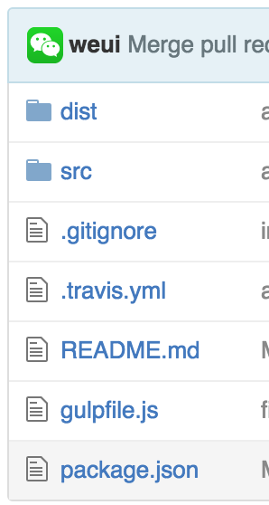

# weui

先说一下weui是一个什么项目：

[WeUI](https://github.com/weui/weui) 为微信 Web 服务量身设计的h5框架

WeUI是一套同微信原生视觉体验一致的基础样式库，为微信 Web 开发量身设计，可以令用户的使用感知更加统一。包含button、cell、dialog、toast、article、icon等各式元素。

它是使用less编写，最终编译成css，压缩成weui.min.css的，当然这里面还使用了一下比较好的开发实践

- web server
- livereload
- watch实时监控
- less：css预处理器
- minify 压缩
- sourcemap 生成

下面我们来扒光它

### 准备工作

首先看目录结构



- 有package.json，说明它是一个node模块或者说它依赖了node模块
- 有gulpfile.js，说明它是使用gulp作为构建工具的。

还有src和dist目录，一般src是源码，dist是构建后生成的目录，至此，我们似乎明白了点什么

首先clone代码

```
git clone https://github.com/weui/weui.git
```

上面说了，有package.json，此时需要安装依赖模块

```
npm install
```

至此就准备完了，下面看一下gulpfile.js

### 看一下它有哪些tasks

看一下它有哪些tasks，查看命令是`gulp -T`

```
➜  weui git:(master) ✗ gulp -T
[14:04:18] Using gulpfile ~/workspace/github/weui/gulpfile.js
[14:04:18] Tasks for ~/workspace/github/weui/gulpfile.js
[14:04:18] ├── source
[14:04:18] ├─┬ styles
[14:04:18] │ └── source
[14:04:18] ├─┬ release
[14:04:18] │ └── styles
[14:04:18] ├── watch
[14:04:18] ├── server
[14:04:18] └── default
```

看这个的目的，其实就为了了解当前gulpfile里tasks，以便让大家有一个概况了解

大概有7个task，其中styles和release是有依赖作业的。

也就是说，整个项目目前的task比较少，比较适合讲解，而且是腾讯公司的项目，大家应该会比较认可一些

ok，下面我们分别看一下每个task

上面讲过，所有的task定义在gulpfile.js里，那么我们就结合源码，看一下gulpfile.js的task是如何定义，以及如何应用的

### default

```
// 参数说明
//  -w: 实时监听
//  -s: 启动服务器
//  -p: 服务器启动端口，默认8080
gulp.task('default', function () {
    if (yargs.s) {
        gulp.start('server');
    }
    if (yargs.w) {
        gulp.start('release');
        gulp.start('watch');
    } else {
        gulp.start('release');
    }
});
```

这是默认作业，也就是在根目录，执行

```
gulp
```

相当于

```
gulp default
```

其实make，rake，ant等都有类似约定。

这里面值得说明的是

- 1) 这是最简单的task定义，无任何依赖作业
- 2) 作业里面使用nodejs写的yargs模块，用户处理cli参数

比如此时可以执行`gulp -s`后者`gulp default -s`

```
➜  weui git:(master) ✗ gulp -s
[14:14:09] Using gulpfile ~/workspace/github/weui/gulpfile.js
[14:14:09] Starting 'default'...
[14:14:09] Starting 'server'...
[14:14:09] Finished 'server' after 44 ms
[14:14:09] Starting 'source'...
[14:14:09] Finished 'source' after 9.24 ms
[14:14:09] Starting 'styles'...
[14:14:09] Finished 'styles' after 14 ms
[14:14:09] Starting 'release'...
[14:14:09] Finished 'release' after 4.62 μs
[14:14:09] Finished 'default' after 71 ms
[BS] 1 file changed (example.css)
[BS] 1 file changed (weui.min.css)
```

然后它就会打开网页，跳转到http://localhost:8080/example/

从task定义里可知

```
    if (yargs.s) {
        gulp.start('server');
    }
```

说明server是一个task，这里的start就相当于call或者invoke某个task的方法。

注：yargs是一个nodejs模块，目前最好的解析cli参数的库

当然，如果这样，是不是太简单了呢？而且亲，你还有2个参数没说呢

是的

- -w: 实时监听
- -p: 服务器启动端口，默认8080

这里要说的就是一个开发惯例，

`-p`很好理解，就是httpserver的短口port，如果指定是7070那就是7070，如果没指定就是8080
给程序员自己定制的空间，谁还没有个端口自定义权利呢？

`-w`比较特殊，这里的w是watch的意思，就是监控某个文件或目录，只要有变化就触发xx动作，一般用于编译，比如coffee，typescript，less，sass等

看一下定义

```
    if (yargs.w) {
        gulp.start('release');
        gulp.start('watch');
```

这里的意思的如果有w参数，就先调release task，然后watch作业。

这里牵连出3个task，有server，watch，release，容我慢慢道来

btw：这里的`if (yargs.w) {`怎么看逻辑都怪怪的，既然有无w都执行release task，这样写法还是有待商榷的。

### server

server task一看就知道是启动服务器，一般前端开发，都是起一个服务器在浏览器里测试

所以还是比较容易理解

看代码

```
gulp.task('server', function () {
    browserSync.init({
        server: {
            baseDir: "./dist"
        },
        ui: {
            port: 8081,
            weinre: {
                port: 9090
            }
        },
        port: 8080,
        startPath: '/example'
    });
});
```

代码里的几个关键词

- browserSync
- server
- port
- startPath
- weinre

[browserSync](http://www.browsersync.io/docs/gulp/)是一个nodejs模块，专门做的是livereload的事儿，也就是说，我们在编辑器里写代码，保存了，文件就会变动，文件变动了就会触发操作系统的监控事件，这时让浏览器刷新

于是，代码变了，不用刷新浏览器就能看到效果。。。

这其实就是传说中得livereload...

又可以偷懒了，祭奠f5吧！！！

其他（server，port，startPath）是browserSync的配置项，有兴趣自己扒文件吧

这里稍稍提一下weinre，因为weui这个项目是移动端h5页面，所以才会用到weinre调试的，是远程调试h5的利器

http://people.apache.org/~pmuellr/weinre-docs/latest/


总结一下

整个server就是browserSync提供的3个功能

- 1）起了一个server
- 2）支持livereload
- 3) 自动打开网页

还不错吧，下面看一下更实用的一个task： watch监控

### watch

```
gulp.task('watch', function () {
    gulp.watch('src/**/*.less', ['styles']);
    gulp.watch('src/example/**/*.{html,js}', ['source'], function () {
        browserSync.reload();
    });
});
```

watch其实就干了2件事儿

- 1）如果'src/**/*.less'变动，执行styles task
- 2）如果'src/example/**/*.{html,js}'变动，先执行'source' task，然后livereload通知浏览器

大家伙只要了解文件变动能干坏事即可，其他可自由发挥

如果gulp内置的watch无法满足，你还可以使用gulp-watch这个单独模块，哈哈，如果有兴趣还可以研究一下操作系统底层监控文件变动接口，有点意思

### release

release是发布最终css的task

```
gulp.task('release', ['styles']);
```

release只是依赖styles task，相当于styles的别名。

值得说明的是，weui是less写的，需要编译成css，然后最终发布的是css文件

那么，

- 如果js是用coffeescript，typescript写的呢？
- 如果css是用less，sass，stylus写的呢？

其实都是一样的思路，编译成js或css，然后发布

这些预处理器，让开发方便，高效的同时，也增加了前端的复杂度，真是老子那句话

福兮祸所伏，祸兮福所倚...

阿门。。。
阿弥托佛。。。

### source

下面一个source task

上面的都比较简单，只是作业定义和作业依赖定义而已，下面看一下真实的流式处理

```
gulp.task('source', function(){
    gulp.src('src/example/**/*.!(less)', option)
        .pipe(gulp.dest(dist))
        .pipe(browserSync.reload({stream: true}));
});
```

回故一下，上面讲的流式内容

- src是输入
- dest是输出
- pipe是管道的意思，也是stream里核心概念，也就是说上一个的输出，是下一个的输入。


这代码里的src里的，所有不是less的文件，都丢到dist目录

```
    gulp.src('src/example/**/*.!(less)', option)
        .pipe(gulp.dest(dist))
```

然后，它又pipe一个，仅仅是为了表示顺序，无上下文传递关系（偷懒做法而已，不可取）

这样写起来是不是非常简单？

我知道你会回答是，下面我们来

讲个不简单的

### styles

下面是关于样式处理的task

```
gulp.task('styles', ['source'], function () {
    gulp.src('src/example/example.less', option)
        .pipe(less().on('error', function (e){
            console.error(e.message);
            this.emit('end');
        }))
        .pipe(gulp.dest(dist))
        .pipe(browserSync.reload({stream: true}));

    gulp.src('src/style/weui.less', option)
        .pipe(sourcemaps.init())
        .pipe(less().on('error', function (e) {
            console.error(e.message);
            this.emit('end');
        }))
        .pipe(sourcemaps.write())
        .pipe(autoprefixer())
        .pipe(gulp.dest(dist))
        .pipe(minify())
        .pipe(rename(function (path) {
            path.basename += '.min';
        }))
        .pipe(gulp.dest(dist))
        .pipe(browserSync.reload({stream: true}));
});
```

这是整个gulpfile里最长的一个task


下面拆成2部分分析一下

- 依赖source，执行完source，然后编译less
- 编译的less有例子和具体要发布的weui.css

part1

```
    gulp.src('src/example/example.less', option)
        .pipe(less().on('error', function (e){
            console.error(e.message);
            this.emit('end');
        }))
        .pipe(gulp.dest(dist))
        .pipe(browserSync.reload({stream: true}));
```

- less()来编译less文件，src和dest大家要看清楚
- 最后pipe了一个livereload触发

和上面的source task类似，只有less编译不一样，这里就不详细讲解了

下面看一下part2

```
    gulp.src('src/style/weui.less', option)
        .pipe(sourcemaps.init())
        .pipe(less().on('error', function (e) {
            console.error(e.message);
            this.emit('end');
        }))
        .pipe(sourcemaps.write())
        .pipe(autoprefixer())
        .pipe(gulp.dest(dist))
        .pipe(minify())
        .pipe(rename(function (path) {
            path.basename += '.min';
        }))
        .pipe(gulp.dest(dist))
        .pipe(browserSync.reload({stream: true}));
```
 
- src是src/style/weui.less
- sourcemaps.init()是初始化sourcemap
- less编译
-  .pipe(sourcemaps.write())是写入sourcemap
- .pipe(autoprefixer())自动增加前缀
- .pipe(gulp.dest(dist)) 输出到dist目录
- .pipe(minify()) 是压缩
- .pipe(rename(function (path) 重命名，因为文件后面要加min
- .pipe(gulp.dest(dist)) 压缩后的文件进行保存
- .pipe(browserSync.reload({stream: true}));是livereload触发

整体是分了3个阶段

- 1）编译less和生成sourcemap
- 2）压缩minify
- 3）触发livereload

### 实战总结

至此，我们就讲完了所有gulpfile里的内容，以及每个task的细节

结论是：这是一个比较典型的gulp项目，还不错

当然它也不是非常完美，比如作业依赖可以优化、代码校验检测、release没有reversion处理等

下面简单看一下package.json

### package.json

这里有2个地方需要注意

```
  "devDependencies": {
    "browser-sync": "^2.9.11",
    "gulp": "^3.8.10",
    "gulp-autoprefixer": "^2.3.1",
    "gulp-less": "^3.0.2",
    "gulp-minify-css": "^0.4.4",
    "gulp-rename": "^1.2.2",
    "gulp-replace": "^0.5.2",
    "gulp-sourcemaps": "^1.6.0",
    "yargs": "^1.3.3"
  }
```

是gulpfile里引用的模块

```
  "scripts": {
    "test": "gulp release"
  },
```

执行npm test即可发布最终css。


## 关于push state
最早一版本的代码 https://github.com/weui/weui/blob/489ddfbc1a9e0cc1f39803aa7ca9609a94ebde75/src/example/example.js

```
/**
 * Created by jfengjiang on 2015/9/11.
 */

$(function () {
    // 页面栈
    var stack = [];
    var $container = $('.js_container');
    $container.on('click', '.js_cell[data-id]', function () {
        var id = $(this).data('id');
        var $tpl = $($('#tpl_' + id).html()).addClass('slideIn').addClass(id);
        $container.append($tpl);
        stack.push($tpl);
        history.pushState({id: id}, '', '#' + id);

        $($tpl).on('webkitAnimationEnd', function (){
            $(this).removeClass('slideIn');
        }).on('animationend', function (){
            $(this).removeClass('slideIn');
        });
        // tooltips
        if (id == 'cell') {
            $('.js_tooltips').show();
            setTimeout(function (){
                $('.js_tooltips').hide();
            }, 3000);
        }

    });

    // webkit will fired popstate on page loaded
    $(window).on('popstate', function () {
        var $top = stack.pop();
        if (!$top) {
            return;
        }
        $top.addClass('slideOut').on('animationend', function () {
            $top.remove();
        }).on('webkitAnimationEnd', function () {
            $top.remove();
        });
    });

    // toast
    $container.on('click', '#showToast', function () {
        $('#toast').show();
        setTimeout(function () {
            $('#toast').hide();
        }, 5000);
    });
    $container.on('click', '#showLoadingToast', function () {
        $('#loadingToast').show();
        setTimeout(function () {
            $('#loadingToast').hide();
        }, 5000);
    });

    $container.on('click', '#showDialog1', function () {
        $('#dialog1').show();
        $('#dialog1').find('.weui_btn_dialog').on('click', function () {
            $('#dialog1').hide();
        });
    });
    $container.on('click', '#showDialog2', function () {
        $('#dialog2').show();
        $('#dialog2').find('.weui_btn_dialog').on('click', function () {
            $('#dialog2').hide();
        });
    })
});
```

11.18日的代码

```
/**
 * Created by jfengjiang on 2015/9/11.
 */

$(function () {
    // page stack
    var stack = [];
    var $container = $('.js_container');
    $container.on('click', '.js_cell[data-id]', function () {
        var id = $(this).data('id');
        go(id);
    });

    // location.hash = '#hash1' 和点击后退都会触发`hashchange`，这个demo页面只关心后退
    $(window).on('hashchange', function (e) {
        if (/#.+/gi.test(e.newURL)) {
            return;
        }
        var $top = stack.pop();
        if (!$top) {
            return;
        }
        $top.addClass('slideOut').on('animationend', function () {
            $top.remove();
        }).on('webkitAnimationEnd', function () {
            $top.remove();
        });
    });

    function go(id){
        var $tpl = $($('#tpl_' + id).html()).addClass('slideIn').addClass(id);
        $container.append($tpl);
        stack.push($tpl);
        // why not use `history.pushState`, https://github.com/weui/weui/issues/26
        //history.pushState({id: id}, '', '#' + id);
        location.hash = '#' + id;

        $($tpl).on('webkitAnimationEnd', function (){
            $(this).removeClass('slideIn');
        }).on('animationend', function (){
            $(this).removeClass('slideIn');
        });
        // tooltips
        if (id == 'cell') {
            $('.js_tooltips').show();
            setTimeout(function (){
                $('.js_tooltips').hide();
            }, 3000);
        }
    }

    if (/#.*/gi.test(location.href)) {
        go(location.hash.slice(1));
    }

    // toast
    $container.on('click', '#showToast', function () {
        $('#toast').show();
        setTimeout(function () {
            $('#toast').hide();
        }, 5000);
    });
    $container.on('click', '#showLoadingToast', function () {
        $('#loadingToast').show();
        setTimeout(function () {
            $('#loadingToast').hide();
        }, 5000);
    });

    $container.on('click', '#showDialog1', function () {
        $('#dialog1').show();
        $('#dialog1').find('.weui_btn_dialog').on('click', function () {
            $('#dialog1').hide();
        });
    });
    $container.on('click', '#showDialog2', function () {
        $('#dialog2').show();
        $('#dialog2').find('.weui_btn_dialog').on('click', function () {
            $('#dialog2').hide();
        });
    });

    function hideActionSheet(weuiActionsheet, mask) {
        weuiActionsheet.removeClass('weui_actionsheet_toggle');
        mask.removeClass('weui_fade_toggle');
        weuiActionsheet.on('transitionend', function () {
            mask.hide();
        }).on('webkitTransitionEnd', function () {
            mask.hide();
        })
    }
    $container.on('click','#showActionSheet', function () {
        var mask = $('#mask');
        var weuiActionsheet = $('#weui_actionsheet');
        weuiActionsheet.addClass('weui_actionsheet_toggle');
        mask.show().addClass('weui_fade_toggle').click(function () {
            hideActionSheet(weuiActionsheet, mask);
        });
        $('#actionsheet_cancel').click(function () {
            hideActionSheet(weuiActionsheet, mask);
        });
        weuiActionsheet.unbind('transitionend').unbind('webkitTransitionEnd');
    });
});
```

## issues

修复`pushState`导致微信从左边缘向右滑动无法返回上一页，而是直接关闭WebView的bug

https://github.com/weui/weui/commit/e547d9d8ef02e2318ce9d173169056e36987abcd

## FAQ

